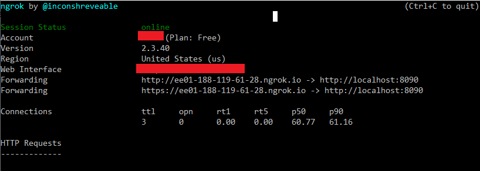

# SiparisVerBot (Telegram Webhook bot) 
##[Under development]

### About
The "SiparisVerBot" is a Telegram bot developed on a Spring Boot that displays products and special offers of a day for a certain store and provides option to make a purchase. The bot demonstrates the usage of webhooks via TelegramWebhookBot API. The bot is available in 3 languages: English, Turkish and Russian. The default stores are turkish stores.

### Requirements

In order to build and run the application you will need:

* Java 11
* Embedded H2 database
* Desktop or mobile version of Telegram

### How to run

First of all, the url for the webhook path has to be obtained. Ngrok was used for that purpose.
1. Download and run ngrok.exe
2. Run the commmand
```
ngrok http 8090
```
You will get forwarding url as following:


Now you can set the webhook either via telegram API,
```
https://api.telegram.org/bot1234567890:XXXXXXX/setWebhook?url=https://ee01-188-119-61-28.ngrok.io
```
or by setting the appropriate property in application.properties file,
```
telegrambot.webhookPath = https://ee01-188-119-61-28.ngrok.io
```
So, all the updates received by "https://ee01-188-119-61-28.ngrok.io" will be forwarded  to "http://localhost:8090".

### How to use

After adding "SiparisVer" bot in Telegram application send "/start" command to start the bot. Now you can use the bot through the menu. Please follow the instructions while using the bot. 

### Code base

Dependencies:
* spring-boot-starter-web
* spring-boot-starter-data-jpa
* mysql
* lombok
* emoji-java

### Other useful Telegram APIs
```
https://api.telegram.org/bot1234567890:XXXXXXX
```
```
https://api.telegram.org/bot1234567890:XXXXXXX/getMe
```
```
https://api.telegram.org/bot1234567890:XXXXXXX/getWebhookInfo
```


